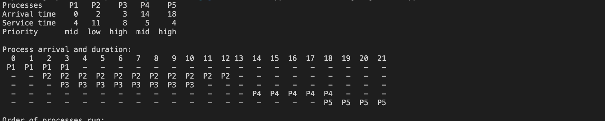
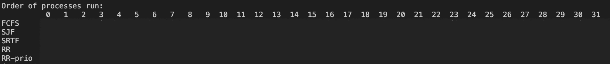

# Objective
Fill in the table of order processes run

### Code
see scheduling-algorithms.py for python program using pandas

### Solution
see scheduling-algorithms.ipynb for graphical solution.

# Objective 2
calculate the average residence time and the average waiting time (hint: gantt chart)

   

###  Solution

See scheduling-algorithms.py

# Objective 3
Why can in practise no two processes arrive at the same time?

###  Solution

See scheduling-algorithms.py

